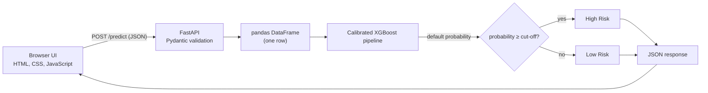
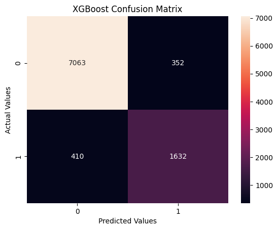
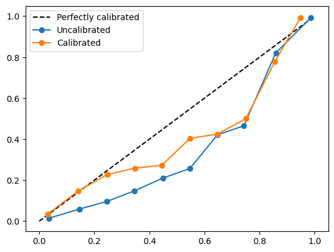
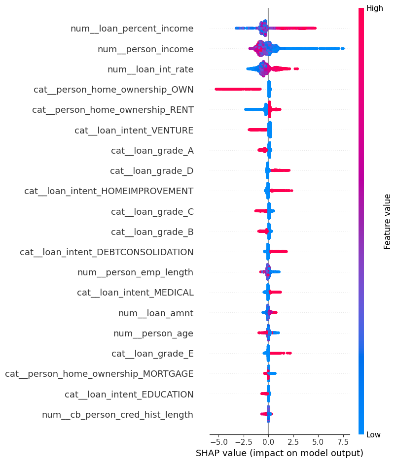
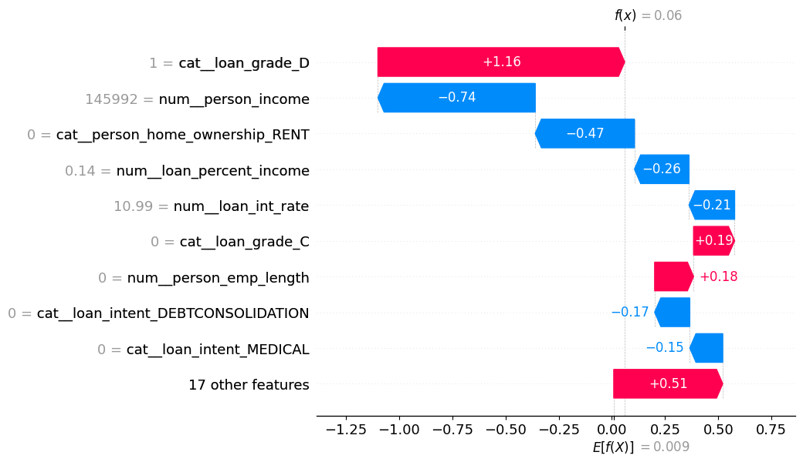

# Explainable Credit Risk Assessment System

Estimate the probability that a loan applicant will default. A calibrated XGBoost model is served through a FastAPI backend and a small web interface, and the model's behaviour is interpreted with SHAP in the accompanying notebook.

**Live demo: https://explainable-credit-risk-assessment-system.onrender.com**

> The demo runs on Render's free tier. After a period of inactivity the server goes to sleep, so the first request can take up to a minute. The page tells you when it is waiting for the server to wake up.

## Contents

1. [Overview](#overview)
2. [Using the web app](#using-the-web-app)
3. [Architecture](#architecture)
4. [Project structure](#project-structure)
5. [Dataset](#dataset)
6. [Methodology](#methodology)
7. [Results](#results)
8. [Explainability](#explainability)
9. [API reference](#api-reference)
10. [Run locally](#run-locally)
11. [Deploy on Render](#deploy-on-render)
12. [Reproduce the model](#reproduce-the-model)
13. [Limitations and responsible use](#limitations-and-responsible-use)
14. [Roadmap](#roadmap)
15. [Tech stack](#tech-stack)

---

## Overview

The system takes 11 facts about a borrower and a loan and returns:

- the model's estimated **probability of default**, and
- a **High Risk / Low Risk** label, decided by comparing that probability with a tuned cut-off (about 0.66).

The project covers the full path from raw data to a deployed application:

| Stage | Where it lives |
| --- | --- |
| Data validation, model comparison, tuning, calibration, threshold selection, SHAP analysis | `credit_risk.ipynb` |
| Trained model and decision threshold | `credit_risk_model.pkl`, `best_threshold.pkl` |
| Prediction API | `main.py` (FastAPI) |
| Web interface | `static/` (HTML, CSS, JavaScript) |
| Hosting | Render (`render.yaml`) |

The "explainable" part is done in the notebook: SHAP shows which features drive the model's predictions, both across all applicants and for a single applicant. The deployed API returns a probability and a label only; see [Limitations](#limitations-and-responsible-use).

---

## Using the web app

1. Open the [live demo](https://explainable-credit-risk-assessment-system.onrender.com).
2. Fill in the borrower and loan details, or select **Fill sample** to load an example (27 years old, income 54,000, renting, education loan of 12,000 at 11.5%, grade C).
3. Select **Assess risk**.

**Reading the result**

- The dial shows the applicant's position between 0% and 100% predicted default probability.
- After the first prediction the dial is split into a green low-risk zone and a red high-risk zone. The split sits at the model's cut-off.
- The verdict is **High Risk** when the probability is at or above the cut-off, otherwise **Low Risk**. The cut-off is shown under the verdict.
- *Loan as share of income* is calculated for you (loan amount divided by annual income) because the model expects it as an input.

The interface is plain HTML, CSS and JavaScript with no build step. It works on phones, shows a message if the server is slow or returns an error, and turns off animation for users who have asked their system to reduce motion.

---

## Architecture



- **One service, one URL.** FastAPI serves the web page and static files as well as the API, so the browser calls `/predict` on its own origin. No CORS setup or separate front-end hosting is needed.
- **Model loaded once.** The model and cut-off are loaded when the server starts (FastAPI lifespan handler) and reused for every request.
- **Preprocessing lives inside the model.** Imputation and one-hot encoding are part of the saved scikit-learn pipeline, so the API passes raw field values straight to `predict_proba`.

---

## Project structure

```
explainable_credit_risk_assessment_system/
├── main.py                    # FastAPI app: serves the UI and the /predict endpoint
├── credit_risk.ipynb          # Analysis, training, evaluation, SHAP
├── credit_risk_dataset.csv    # Source data (32,581 loan applications)
├── credit_risk_model.pkl      # Calibrated XGBoost pipeline (about 3.6 MB)
├── best_threshold.pkl         # Decision cut-off
├── requirements.txt           # Pinned Python dependencies
├── runtime.txt                # Python version for the host (3.12.3)
├── .python-version            # Python version for local tooling (3.12.3)
├── render.yaml                # Render service definition
├── static/
│   ├── index.html             # Page structure
│   ├── style.css              # Styling
│   └── script.js              # Form handling, API call, dial animation
└── docs/images/               # Figures used in this README
```

---

## Dataset

`credit_risk_dataset.csv` contains **32,581 loan applications** with 12 columns. The target is `loan_status`. Currency is not specified in the data.

| Column | Type | Meaning |
| --- | --- | --- |
| `person_age` | integer | Applicant age in years |
| `person_income` | number | Annual income |
| `person_home_ownership` | category | `RENT`, `MORTGAGE`, `OWN`, `OTHER` |
| `person_emp_length` | number | Length of employment in years |
| `loan_intent` | category | `EDUCATION`, `MEDICAL`, `VENTURE`, `PERSONAL`, `DEBTCONSOLIDATION`, `HOMEIMPROVEMENT` |
| `loan_grade` | category | Loan grade `A` to `G` |
| `loan_amnt` | number | Loan amount |
| `loan_int_rate` | number | Interest rate in percent |
| `loan_percent_income` | number | Loan amount divided by annual income |
| `cb_person_default_on_file` | category | Previous default on record: `Y` or `N` |
| `cb_person_cred_hist_length` | integer | Length of credit history in years |
| `loan_status` | integer | **Target.** `1` = defaulted, `0` = did not default |

**Key facts about the raw data**

- **Class imbalance.** 25,473 non-defaults and 7,108 defaults, so about 21.8% of loans defaulted.
- **Missing values.** `person_emp_length` is missing in 895 rows and `loan_int_rate` in 3,116 rows. No other column has gaps.
- **Impossible or extreme values.** Five ages above 100 (maximum 144) and employment lengths up to 123 years.

**Default rate by loan grade** (cleaned data, 31,522 rows). Risk rises with grade, and jumps sharply at grade D:

| Grade | A | B | C | D | E | F | G |
| --- | --- | --- | --- | --- | --- | --- | --- |
| Applications | 10,300 | 10,121 | 6,301 | 3,549 | 951 | 236 | 64 |
| Default rate | 9.6% | 16.0% | 20.3% | 58.8% | 64.2% | 70.3% | 98.4% |

**Default rate by home ownership** (cleaned data): own 6.9%, mortgage 12.5%, rent 31.1%, other 31.1%. The "other" group is small (106 rows).

---

## Methodology

```mermaid
flowchart LR
    A["credit_risk_dataset.csv<br/>32,581 rows"] --> B["Validate and clean<br/>31,522 rows"]
    B --> C["Stratified split<br/>70% train, 30% test"]
    C --> D["Impute and<br/>one-hot encode"]
    D --> E["XGBoost<br/>scale_pos_weight 3.63"]
    E --> F["RandomizedSearchCV<br/>150 candidates x 5 folds"]
    F --> G["Sigmoid calibration<br/>5-fold"]
    G --> H["F1-optimal cut-off<br/>about 0.66"]
    H --> I["credit_risk_model.pkl<br/>best_threshold.pkl"]
```



### 1. Validation and cleaning

| Step | Rows remaining |
| --- | --- |
| Raw data | 32,581 |
| Remove duplicate rows | 32,416 |
| Keep ages 18 to 100 | 32,411 |
| Keep employment length ≤ 60 years and ≤ age | 31,522 |
| Keep loan amount > 0 | 31,522 |

The employment-length filter also removes rows where the value is missing, because a missing value fails the comparison. After cleaning, no missing employment lengths remain. About 3,027 missing interest rates remain and are imputed inside the model pipeline.

### 2. Train/test split and class imbalance

- Stratified 70/30 split with `random_state=42`, giving 22,065 training rows and a 9,457-row test set (7,415 non-defaults and 2,042 defaults).
- The training set has about 3.63 non-defaults for every default. This ratio is used as `scale_pos_weight` for XGBoost, and `class_weight="balanced"` is used for logistic regression and random forest.

### 3. Preprocessing

Each model has its own `ColumnTransformer` inside its scikit-learn `Pipeline`:

- **Numeric columns:** median imputation (plus standard scaling for logistic regression only).
- **Categorical columns:** constant imputation (`"missing"`) followed by one-hot encoding with `handle_unknown="ignore"`.

### 4. Model comparison (5-fold stratified cross-validation on the training set)

| Model | ROC-AUC | Accuracy | Precision | Recall | F1 |
| --- | --- | --- | --- | --- | --- |
| Logistic regression (baseline) | 0.871 | 0.812 | 0.545 | 0.777 | 0.641 |
| XGBoost (300 trees, depth 5) | **0.946** | 0.918 | 0.819 | 0.796 | 0.808 |
| Random forest (200 trees) | 0.928 | 0.933 | 0.972 | 0.709 | 0.820 |

XGBoost had the highest cross-validated ROC-AUC and was the model carried forward to tuning and deployment. A random forest tuning and calibration path exists in the notebook but is commented out.

### 5. Hyperparameter tuning

`RandomizedSearchCV` evaluated 150 candidate settings with 5-fold cross-validation (750 fits), scoring on average precision, which suits an imbalanced target. The best candidate reached a cross-validated average precision of 0.90.

| Parameter | Search range | Best value |
| --- | --- | --- |
| `n_estimators` | 150 to 599 | 408 |
| `max_depth` | 3 to 8 | 6 |
| `learning_rate` | 0.01 to 0.51 | 0.129 |
| `subsample` | 0.6 to 1.0 | 0.915 |
| `colsample_bytree` | 0.6 to 1.0 | 0.842 |
| `min_child_weight` | 1 to 9 | 5 |
| `gamma` | 0 to 5 | 2.363 |

### 6. Probability calibration

Class weighting pushes raw XGBoost probabilities upward, so they overstate how often applicants actually default. The tuned model was wrapped in `CalibratedClassifierCV` (sigmoid method, 5-fold) so the output behaves more like a real probability. For example, one applicant's raw score of 0.048 became 0.020 after calibration.

### 7. Decision cut-off

Using the calibrated probabilities, the cut-off was chosen as the value on the precision-recall curve that maximises F1. It came out at about **0.66** and is stored in `best_threshold.pkl`. The API flags an application as High Risk when its probability is greater than or equal to this value.

---

## Results

All figures in this section are measured on the held-out test set of 9,457 applications.

### Baseline versus tuned XGBoost

Metrics are for the default-risk class (`1`), using the models' default decision rule.

| Model | Accuracy | Precision | Recall | F1 |
| --- | --- | --- | --- | --- |
| Logistic regression | 0.82 | 0.55 | 0.78 | 0.65 |
| **Tuned XGBoost** | **0.92** | **0.82** | **0.80** | **0.81** |

XGBoost keeps recall about the same as the baseline while raising precision from 0.55 to 0.82, so far fewer good applicants are wrongly flagged.

### Confusion matrix (tuned XGBoost)



| | Predicted no default | Predicted default |
| --- | --- | --- |
| **Actually no default** | 7,063 | 352 (false positives) |
| **Actually defaulted** | 410 (false negatives) | 1,632 |

The model missed 410 borrowers who went on to default and wrongly flagged 352 who did not. In lending the two errors rarely cost the same, and the cut-off is the lever for trading one against the other.

### Calibration



Calibration moves the curve closer to the diagonal (perfect calibration) across most probability bins. The middle range, roughly 0.2 to 0.8, still sits below the diagonal, which means the model tends to **overstate** default probability there. Treat the percentage shown in the app as a risk score rather than an exact frequency.

### What is not measured

The notebook reports test-set metrics for the tuned XGBoost model before calibration, at the default 0.5 rule. It does not report metrics for the deployed configuration (calibrated model at the 0.66 cut-off). See [Limitations](#limitations-and-responsible-use).

---

## Explainability

SHAP (`TreeExplainer`) was applied to the XGBoost model on the test set.

### Global view: what drives predictions



Features are ranked by average impact. Positive SHAP values push toward default and negative values push away. The clearest patterns in the plot:

| Feature | Effect on predicted default risk |
| --- | --- |
| `loan_percent_income` | Higher share of income going to the loan raises risk. The strongest driver. |
| `person_income` | Lower income raises risk; higher income lowers it. |
| `loan_int_rate` | Higher interest rate raises risk. |
| `person_home_ownership` | Owning a home lowers risk strongly; renting raises it. |
| `loan_grade` | Grades D and E raise risk; grades A, B and C lower it. |
| `loan_intent` | Venture and education loans lower risk; home improvement, debt consolidation and medical loans raise it. |

These are patterns the model learned from data, not causal effects. Note that SHAP values are in the model's log-odds units, not probabilities.

### Local view: one applicant



The waterfall explains one applicant from the test set (index 5). Their loan grade of D pushes the prediction toward default (+1.16), while their income of 145,992 (−0.74), not renting (−0.47), a loan equal to 14% of income (−0.26) and an interest rate of 10.99% (−0.21) push it back down.

### Caveat

The SHAP analysis was run on the XGBoost pipeline trained with default settings (learning rate 0.1, `scale_pos_weight` set), not on the tuned and calibrated model that is deployed. The two should behave similarly, but the plots are not an exact explanation of the deployed model.

---

## API reference

Interactive documentation, generated by FastAPI, is available at `/docs` on any running instance, for example [the live demo's `/docs`](https://explainable-credit-risk-assessment-system.onrender.com/docs).

| Method | Path | Purpose |
| --- | --- | --- |
| `GET` | `/` | Serves the web interface |
| `GET` | `/health` | Health check. Returns `{"status": "ok"}` |
| `POST` | `/predict` | Scores one loan application |
| `GET` | `/docs` | Interactive API documentation |

### `POST /predict`

**Request body (JSON), all fields required**

| Field | Type | Allowed values |
| --- | --- | --- |
| `person_age` | integer | Whole years |
| `person_income` | number | Annual income |
| `person_home_ownership` | string | `RENT`, `MORTGAGE`, `OWN`, `OTHER` |
| `person_emp_length` | number | Years employed |
| `loan_intent` | string | `EDUCATION`, `MEDICAL`, `VENTURE`, `PERSONAL`, `DEBTCONSOLIDATION`, `HOMEIMPROVEMENT` |
| `loan_grade` | string | `A` to `G` |
| `loan_amnt` | number | Loan amount |
| `loan_int_rate` | number | Percent, for example `11.5` |
| `loan_percent_income` | number | `loan_amnt / person_income` |
| `cb_person_default_on_file` | string | `Y` or `N` |
| `cb_person_cred_hist_length` | integer | Years |

**Example request**

```bash
curl -X POST https://explainable-credit-risk-assessment-system.onrender.com/predict \
  -H "Content-Type: application/json" \
  -d '{
    "person_age": 27,
    "person_income": 54000,
    "person_home_ownership": "RENT",
    "person_emp_length": 4,
    "loan_intent": "EDUCATION",
    "loan_grade": "C",
    "loan_amnt": 12000,
    "loan_int_rate": 11.5,
    "loan_percent_income": 0.22,
    "cb_person_default_on_file": "N",
    "cb_person_cred_hist_length": 5
  }'
```

**Response shape** (the probability shown here is illustrative)

```json
{
  "default_probability": 0.12,
  "default_prediction": 0,
  "threshold": 0.66,
  "Result": "Low Risk"
}
```

| Field | Meaning |
| --- | --- |
| `default_probability` | Calibrated estimate that the borrower defaults, between 0 and 1 |
| `default_prediction` | `1` if the probability is at or above `threshold`, otherwise `0` |
| `threshold` | The cut-off used |
| `Result` | `"High Risk"` or `"Low Risk"` |

### Behaviour to know about

- **Missing fields or wrong types** return HTTP `422` with details from Pydantic.
- **Category values must match exactly, in uppercase.** The schema accepts any string, and the model's encoder silently ignores categories it has not seen. A value like `"rent"` is not rejected. It is treated as unknown and can produce a misleading score.
- **There are no range checks.** The model was trained on ages 20 to 94, incomes from 4,000 to about 2.04 million, loan amounts from 500 to 35,000 and interest rates from 5.42% to 23.22%. Inputs far outside these ranges give unreliable results.
- **`loan_percent_income` is not computed by the API.** Send `loan_amnt / person_income` yourself. The web interface does this automatically.

---

## Run locally

Requires Python 3.12 (the version used to train and pin the model).

```bash
git clone https://github.com/Ruhi1010/explainable_credit_risk_assessment_system.git
cd explainable_credit_risk_assessment_system

python -m venv venv
venv\Scripts\activate            # Windows
# source venv/bin/activate       # macOS and Linux

pip install -r requirements.txt
uvicorn main:app --reload
```

Open http://127.0.0.1:8000 for the interface, or http://127.0.0.1:8000/docs for the API documentation.

The pinned versions in `requirements.txt` matter. Pickled scikit-learn and XGBoost models can fail to load, or behave differently, under other versions.

---

## Deploy on Render

The live demo is a Render **Web Service** on the free plan.

| Setting | Value |
| --- | --- |
| Runtime | Python |
| Build command | `pip install -r requirements.txt` |
| Start command | `uvicorn main:app --host 0.0.0.0 --port $PORT` |
| Python version | 3.12.3 (from `.python-version` and `runtime.txt`) |
| Auto-deploy | Set to `true` in `render.yaml`, so pushes to the connected branch redeploy |

Notes:

- Render supplies the port through the `$PORT` variable, which the start command uses.
- Both model files are committed to the repository (about 3.6 MB in total), so no external storage is needed.
- The front end calls the relative path `/predict`. Keep it relative so the same code works locally and on Render.
- Free instances sleep when idle, which causes the slow first request described at the top.

---

## Reproduce the model

1. Install the dependencies from `requirements.txt`, plus the notebook-only packages: `pip install shap matplotlib seaborn jupyter`.
2. Open `credit_risk.ipynb` and run it from top to bottom. The final cells write `credit_risk_model.pkl` and `best_threshold.pkl`.
3. Restart the API to load the new files.

The notebook was run with Python 3.12.3, NumPy 2.0.0, SciPy 1.16.1, scikit-learn 1.7.1, XGBoost 3.4.1, pandas 2.3.1, joblib 1.5.1 and SHAP 0.52.0. If you retrain under different versions, update `requirements.txt` to match, or the deployed app may not be able to load the new pickles.

---

## Limitations and responsible use

This is an educational and portfolio project. It should not be used to make real lending decisions.

- **Single dataset.** The model learned from one dataset and may not generalise to other populations, time periods or countries.
- **Sensitive features.** Age and home ownership are model inputs. Many jurisdictions restrict how attributes like these may be used in credit decisions, and a production system would need a fairness and compliance review.
- **Cut-off chosen on the test set.** The 0.66 cut-off was picked by maximising F1 on the same test set used for reporting, so any metric measured there at that cut-off would be somewhat optimistic. A separate validation split, or cross-validation, would be cleaner.
- **Deployed configuration not fully evaluated.** Test metrics exist for the tuned model before calibration, not for the calibrated model at the 0.66 cut-off.
- **Probabilities are approximate.** The calibration curve shows the model still overstates risk in the middle of the range.
- **Explanations are offline.** SHAP results live in the notebook and were computed on the default-parameter XGBoost model rather than the deployed one. The live app does not explain individual predictions.
- **Rare groups.** Some categories are small (grade G has 64 applications, home ownership "other" has 106), so patterns there are less reliable.
- **Input validation is minimal.** The API checks types, not ranges or category names.
- **Free-tier hosting.** Cold starts make the first request slow, and there is no uptime guarantee.

---

## Roadmap

Possible next steps:

- Evaluate the calibrated model at the deployed cut-off on data not used to choose it.
- Return per-request SHAP contributions from the API and show them in the interface.
- Validate categories and numeric ranges in the request schema.
- Add automated tests for the API and a GitHub Actions workflow.
- Add a Dockerfile for portable deployment.
- Run a fairness analysis across age groups and home-ownership categories.

---

## Tech stack

| Area | Tools |
| --- | --- |
| Language | Python 3.12.3 |
| Modelling | scikit-learn 1.7.1, XGBoost 3.4.1, pandas 2.3.1, joblib 1.5.1 |
| Interpretation | SHAP 0.52.0 (notebook only) |
| API | FastAPI 0.141.0, Uvicorn 0.54.0, Pydantic 2.13.5 |
| Front end | HTML, CSS, JavaScript (no framework), Google Fonts |
| Hosting | Render |

---

Built by [@Ruhi1010](https://github.com/Ruhi1010).